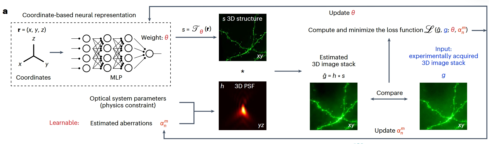
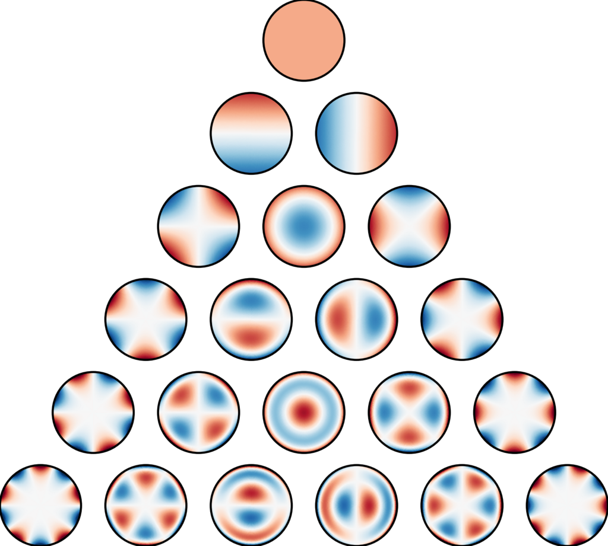

# 宽场荧光显微的计算自适应光学与三维重建
生物医学成像与处理中的人工智能 课程大作业

## 项目时间表

| 2025/04/17 | 04/17~04/25 | 04/25~05/08 | 2025/05/08 |
|:------------:|:-------------:|:------------:|:-----:|
| 布置题目 | 阅读给定的论文和相关资料，尝试复现代码 | 进行第二三阶段任务，准备项目答辩 | 项目答辩 |

## 资源文件
本作业中涉及到的所有电子资源，见[此列表](resource.md)

## Stage 1: 文章阅读
- 阅读参考文献 [Coordinate-based neural representations for computational adaptive optics in widefield microscopy](https://www.nature.com/articles/s42256-024-00853-3)
- 主要了解以下几个信息：
    - CoCoA的主要任务/目标是什么？
    - CoCoA采用了怎样的网络结构和重建方法来实现目标？
    - CoCoA是如何将像差校正与三维重建任务结合的？
    - 阅读背景知识补充，回答以下问题：
        - 光学显微成像中像差的来源是什么？
        - 像差会对成像带来怎样的不利影响？
    
- 相关领域的背景知识补充，可见小节 Stage 1.5

<div align="center">

<br>
CoCoA 重建流程
</div>

### Stage 1.5: 背景知识补充
对 NeRF/INR, 宽场荧光显微, 像差与自适应光学的部分参考资料如下：
- [NeRF: Neural Radiance Fields](https://www.matthewtancik.com/nerf)
    - 主要了解 NeRF 的工作原理
    - 神经网络（位置编码 + MLP）在其中的作用
- [The sampling limit in fluorescence microscopy](https://www.sciencedirect.com/science/article/pii/S0968432806001260)
    - 主要关注前两小节内容
    - 宽场荧光显微的成像过程如何建模
- [Application of adaptive optics in biological fluorescent microscopy](https://www.researchgate.net/publication/318192587_Application_of_adaptive_optics_in_biological_fluorescent_microscopy)
    - 提供光学显微镜中的像差与自适应光学的背景
    - 还有各类显微成像模态的背景知识

## Stage 2: 效果复现
论文给出的原始代码和数据参见：[github.com/iksungk/CoCoA](https://github.com/iksungk/CoCoA)

本仓库在此基础上整理得到，具体的复现过程（环境配置、命令格式等）见[原仓库README](./original_README.md)

论文复现所需数据可从[box链接](https://box.nju.edu.cn/d/813424af4c6e463ea7e8/)的`source/`目录下下载，
下载后放在工作目录`./source`文件夹下，形式如
```
-|source
-----|beads
-----|figure_2
-----|figure_5
-----|...
```

- 本阶段主要任务
    - 根据给出的源代码以及小球数据，跑通 CoCoA 的重建流程
    - 在给出的另外两个数据上复现文章结果（需要改动文件读取部分的内容）
    - 对比CoCoA在开启像差校正功能前后，对样本三维重建的效果

- 关于PSF模型中使用 Zernike 多项式计算像差的部分，可以参考[psf_torch.py](./misc/psf_torch.py)中的`zernike_polynomial`函数以及函数注释中给出的两个链接
    - https://en.wikipedia.org/wiki/Zernike_polynomials
    - https://wp.optics.arizona.edu/jsasian/wp-content/uploads/sites/33/2016/03/ZP-Lecture-12.pdf

<div align="center">

<br>
Zernike 多项式
</div>

- 本阶段任务的内容请参考`main/`目录下[wf_cocoa_demo.ipynb](./main/wf_cocoa_demo.ipynb)文件中的代码和说明

## Stage 3: 代码上手
本阶段主要任务：
1. 对宽场荧光成像模型的建模，请参考`main/`目录下[wf_model.ipynb](./main/wf_model.ipynb)文件中的代码和说明
2. 搭建INR网络结构
3. 使用指定的样本完成完整的仿真流程

持续更新中

有任何本作业相关的问题或想法，请及时反映。可以直接在本仓库中提出 issue（议题），也可以直接联系助教